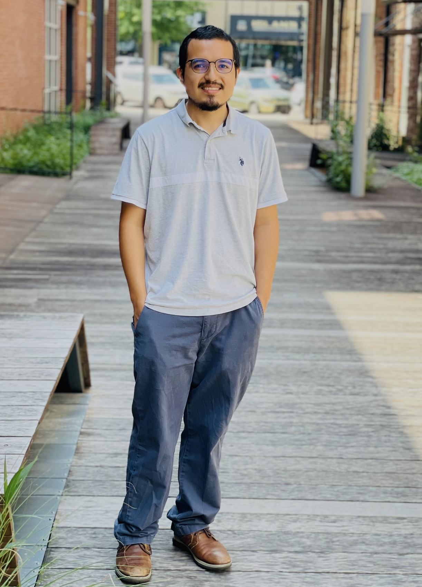

# Welcome

## About Me
<!-- Parent Container -->

 

  <!-- Left Column (Image) -->
  

    
I am an IT professional with a strong foundation in troubleshooting, networking, and technical support. 

    
 I am seeking entry-level roles in help desk, IT support, desktop support, or similar positions, where I can apply my knowledge and grow my skills. 
 
    
 I am eager to learn new technologies, assist users effectively, and contribute reliable IT solutions. 

  

  <!-- Right Column (Text) -->
  

    
  

<!-- Clear the float after the container -->

## Certifications

 

  <!-- Left Column (Image) -->
  

    <a href="https://www.credly.com/badges/353f2f3e-7fca-401f-8b72-14640cb13bc8/linked_in_profile"><h3>CompTIA A+</h3></a>
  

  <!-- Right Column (Text) -->
  

    
  

<!-- Clear the float after the container -->

## Education
<h3>B.S Computer Science, CSU San Marcos </h3>