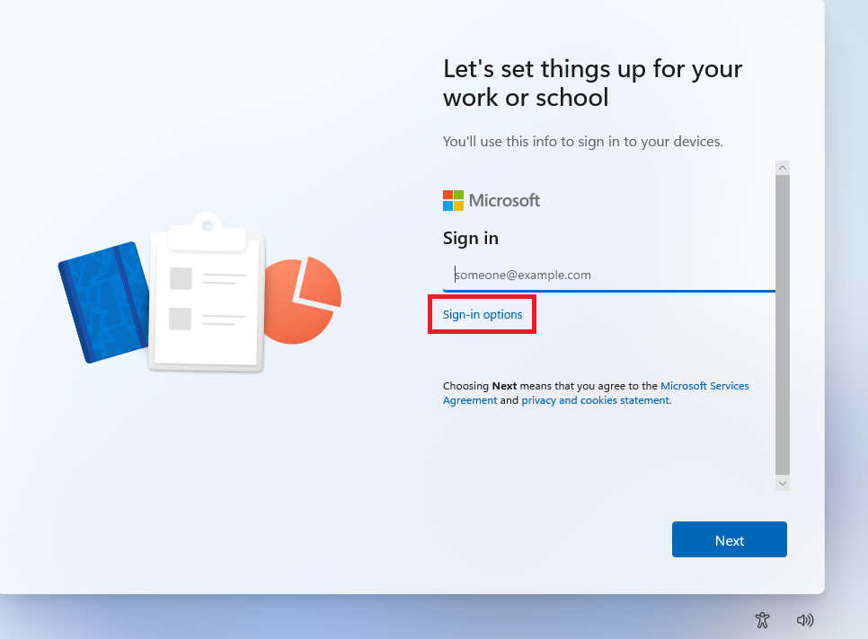
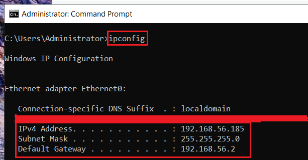
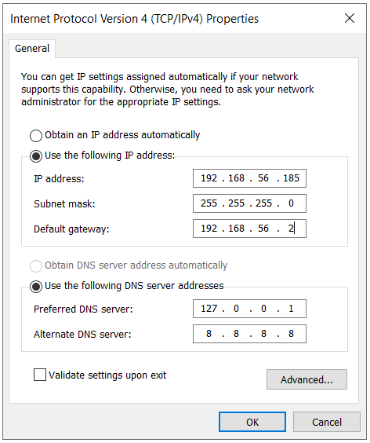
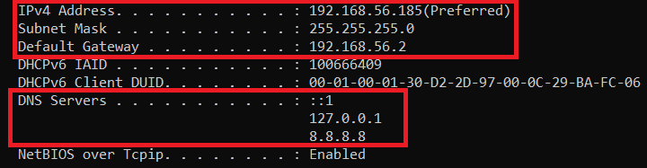
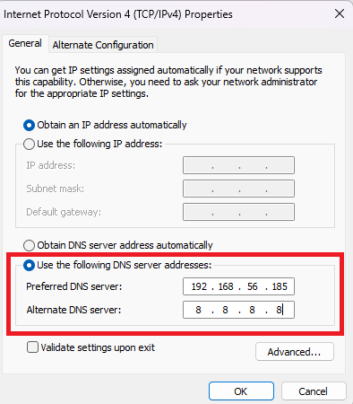
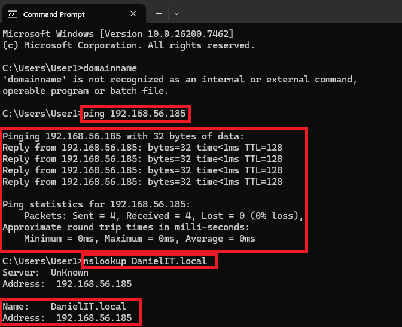
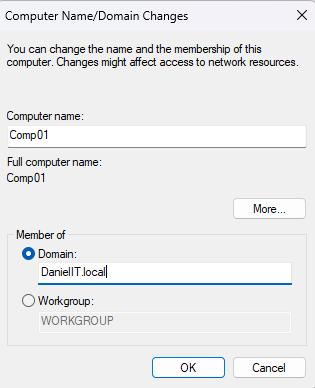
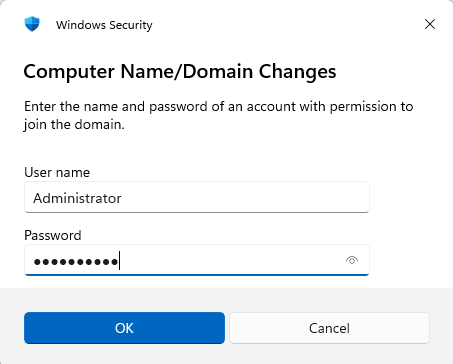
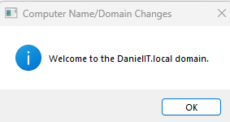

# GPO Application and Testing
In this project we will be applying and testing GPOs in our domain.

**Group Policy** are security rules and configuration settings for users and computers.

**GPOs** or **group policy objects** are used to apply group policy to users, computers, and groups.

## Operating Systems
- Windows 11 (x86-64)
- Windows 11 Pro
- Windwos 11 Enterprise
- Windows 10 Enterprise
- Windows Server 2022 (x86-64)

## Environments and Technologies Used
- VMware Workstation Pro for Personal Use (Windows)

## GPO Application and Testing
To apply and test our GPOs we created and configured in [GPO Creation and Configuration](../GPO_creation_configuration/GPO_creation_configuration.md), we must first create a client VM with **Windows 11/10 Pro** or **Windows 11/10 Enterprise**.

After we've created the client VM, we connect it with the DC and then add it to the domain. Then we can test our GPO policies with users in the domain using the client VM.

### Client VM Creation

We will use the [Windows 11 Enterprise](https://www.microsoft.com/en-us/evalcenter/download-windows-11-enterprise) client VM.

After the OS is installed, select *sign-in options*.



Then, select **domain-join** and enter a username. We will name our user *User1*.

### Windows Server DNS Setup
After our client VM is setup, in our DC we must configure it as the **authoritative DNS server**.

An **authoritative DNS server** is a DNS server that holds **official** DNS records for a **domain** or **zone**.

To configure the server we go to: 

```Settings > Network & Internet > Change Adapter Options > Ethernet0 > Right-click > Properties > Internet Protocol Version 4 (TCP/IPv4) > Double-click```

After that we must set a **static IP**.

We will set the static IP as the one already assigned to it for simplification. We can check what it is using ```ipconfig``` in the command prompt.



Then we will set the **DNS Server** to the **loopback IP** to ensure the DC resolves DNS queries to interfaces in the domain.

We will also set the alternative DNS to the google DNS server for DNS queries to the Internet.



We can verify the static IP and DNS server using ```ipconfig /all```.



### Windows Client DNS setup
Now we will configure the DNS server for the client machine.

```Settings > Network & Internet > Advanced Network Settings > More adapter options: Edit > Internet Protocol Version 4 (TCP/IPv4) > Double-click```

We will set the DNS server as the DC and the alternative DNS server as the Google DNS server.



We will confirm we can communicate with the client by using ```ping``` and ```nslookup```.



We were able to ping the domain and resolve the domain name to an ip, so the DNS server was configured correctly.

### Windows Client Domain-Join
To join the client machine to the domain we go to:

```Settings > System > About > Domain or Workgroup > Change```

We will rename our computer as ```Comp01``` and set the domain as ```DanielIT.local```.



We are then prompted for admin credentials to join to the domain.

We will use the Administrator account we used to create the domain.



If the join is successful we should get a welcome message.

