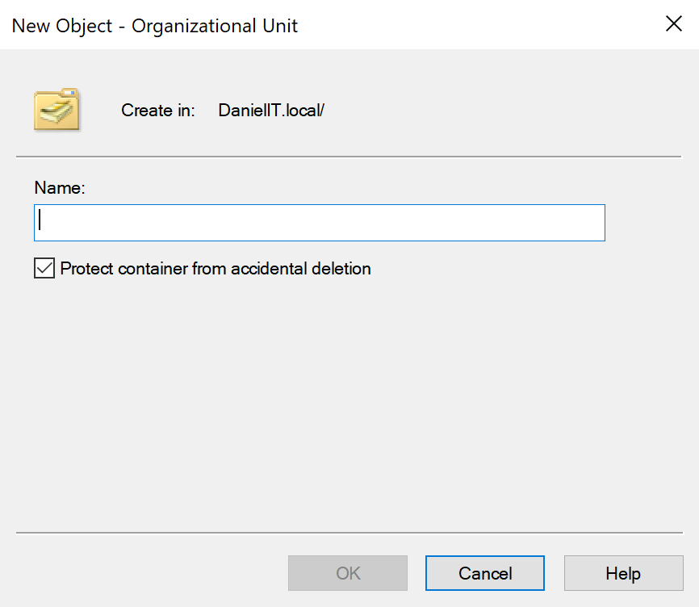
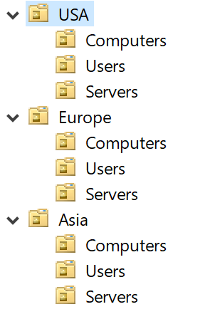
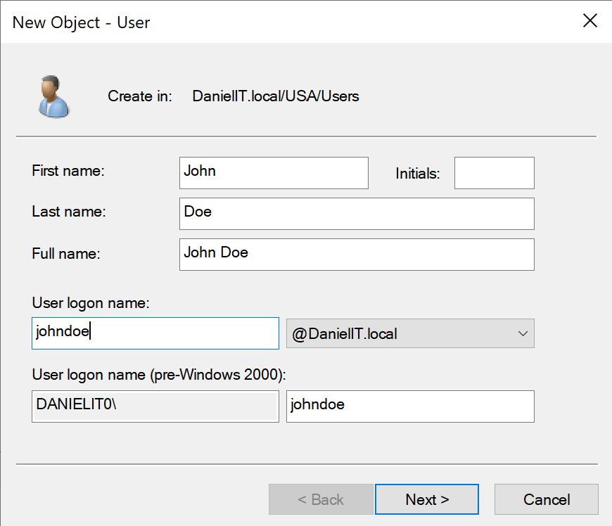
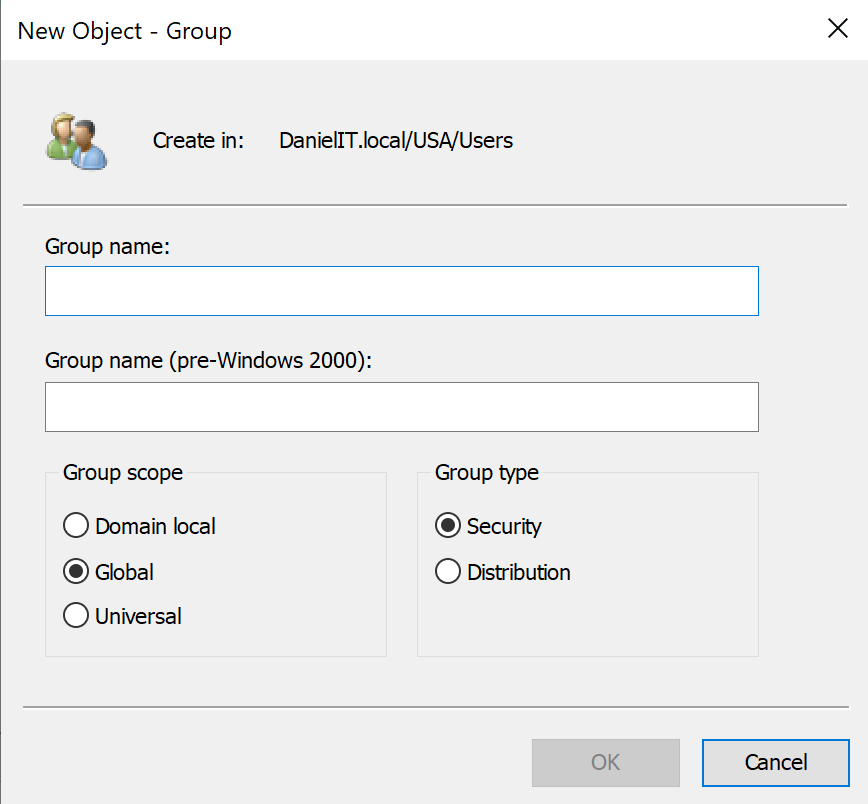

# Organizational Units, Users, & Groups Creation

In this project we will create **organizational units (OUs)** for our domain. We will also create users and groups for our OUs.


## Operating Systems
- Windows 11 (x86-64)
- Windows Server 2022 (x86-64)

## Environments and Technologies Used
- VMware Workstation Pro for Personal Use (Windows)

## OUs, Users, and Groups Creation
### OUs
An **OU** is a container in AD that allows us to organize computers, users, groups, and other objects. It allows adminstrators to logically structure resources in a domain.

#### Setup
To add an OU we select:

```
Windows Key > Windows Administrative Tools > Active Directory Users and Computers
```

This brings the following menu: <br/><br/>


As we can see, our domain **DanielIT.local** already has pre-built OUs.

We will then create OUs for the different country departments in our domain:

``` 
Right-click Root Domain > New > Organizational Unit
```

Here, we write a name and select **OK** to create the OU.



We'll create OUs for each geopgraphical location and each resource type:



### Users
**Users** represent individuals in a domain that can **access resources**.

#### Setup
```Right-click OU > New > User```



We then fill out their credentials information to complete their creation.

### Groups

When that is complete, we'll configure **groups, group scopes, and group types** for our OUs.<br/><br/>

**Groups** are containers are used to assign **security policy**, **permissions to resources**, and **simplify managment**.

- Instead of assigning permissions to individuals, we assign users to groups.

**Group Scope** defines where a group can contain members from and where it can be granted permissions or assigned security policy.

There are 3 group scopes:

1. Domain Local
    - Used for: Assigning permissions to resources within **a single domain**.
    - Members can come from:
        - Same domain.
        - Other domains in the forest.
        - Trusted domains.
        - Universal groups.
        - Global groups.
    - Where it can be granted permissions:
        - Only in the domain where the group is created.
    - Typical scenario: "Who can access this file server?"
        - Example: ```DL_Fileserver_read```

2. Global
    - Used for: Assigning permissions to users or computers in the same domain, typically with the same job role.
    - Members can come from:
        - Only the in the domain the group is created.
    - Where it can be granted permissions:
        - Any domain in the forest (or trusted forest)
    - Typical scenario: "Who are the Help Desk staff?/Who is in HR?"
        - Example: ```GG_HelpDesk_Users/GG_HR_Users```

3. Universal
    - Used for: Grouping users from multiple domain, typically with the same job role.
    - Members can come from:
        - Any domain in the forest.
    - Where it can be granted permissions:
        - Any domain in the forest.
    - Typical scenario: "Users from multiple domains with the same job role need the same access."
        - Example: ```UG_All_IT_Staff```

**Group type** defines the purpose of the group - whether it's used for **security** or **distribution/email**:

- Security group
    - Used for: 
        - **Assigning permissions to resources** 
    - Resources:  
        - File shares
        - NTFS folders
        - Printers 
        - Applications
        - GPO security filtering 
        - Etc.
    - Example: Security group ```HR_ReadOnly``` gives access to HR file share.
- Distribution group (Distro List)
    - Purpose: Create **email distributions** for sending emails to a list of users.
    - Example: Distribution group ```AllEmployees``` is used for sending company-wide emails.

#### Setup
```Right-click OU > New > Group```



After clicking OK a new group will be added to the OU.