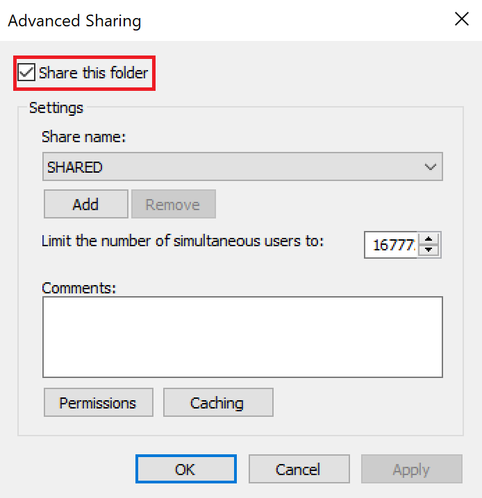
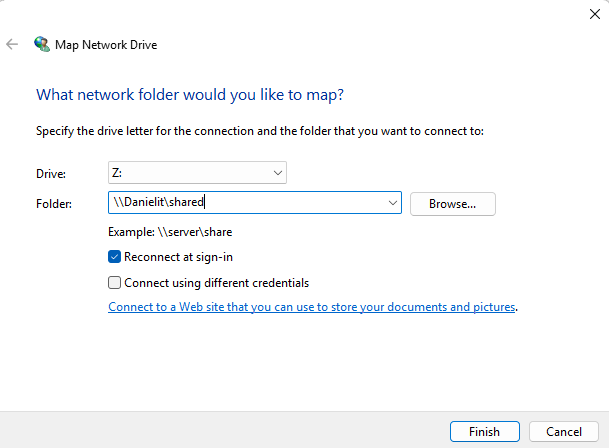
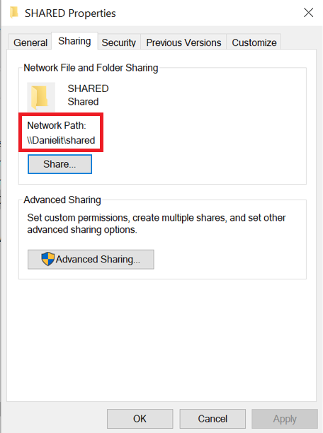
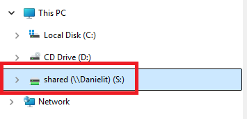
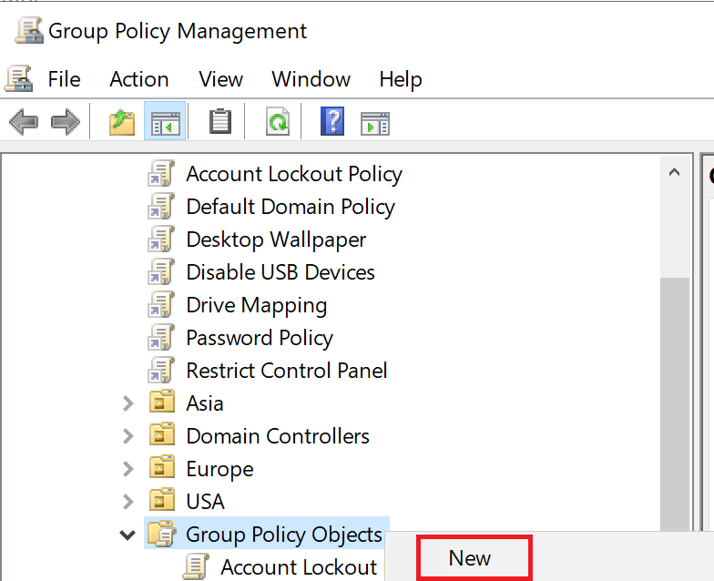
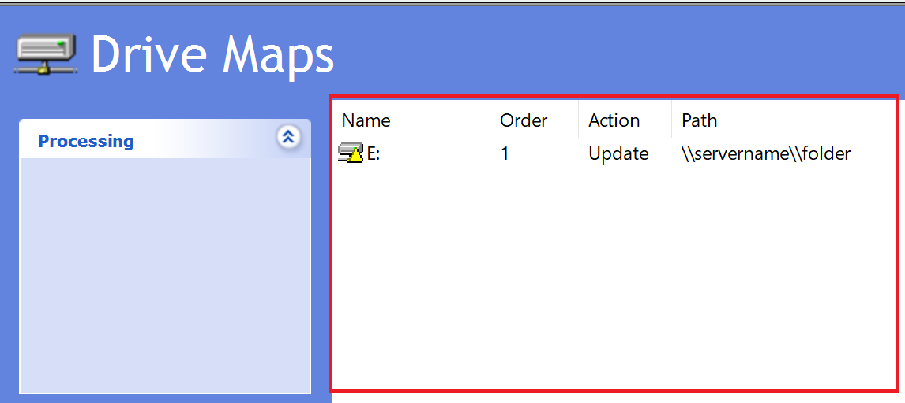
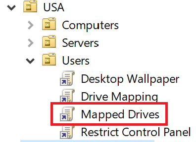
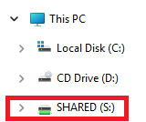
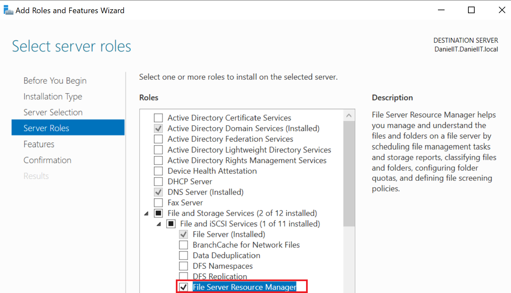
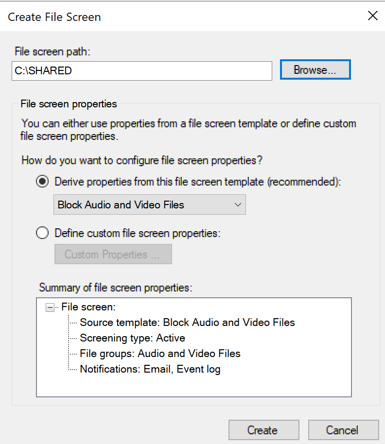

# File Sharing and FSRM Setup


In this lab we will setup **file network sharing** for a server and client machine.

## Summary
**Network sharing** is the sharing of resources over a network, so other devices or users can access them. These resources called **shares** could be folders, printers, drives, etc.

We will configure a **file share** which is a shared folder.

The types of permissions we can configure for file shares are **NTFS** and **Share** permissions.
- NTFS allows for file and folder level control.
- Share allows only folder level control.

After we set up our file share, we can manage it using **FSRM**, the **File Server Resource Manager**.

## Prerequisites
### OS system
- Windows Server 2022 in VM
- Windows 11 Enterprise in VM

### Tools
- Active Directory Domain Services (AD DS)
- Group Policy Management Console (GPMC)

## Setting Up the Share
### Create Share Folder in Server
To set up file sharing we will create a shared folder in our server VM. We will assign it appropriate NTFS and Share permissions to allow domain users access.  We will call it **SHARED**.


To configure permissions we will right-click the folder:

```Properties > Sharing tab > Advanced Sharing``` 

### Set Permissions
#### Share Permissions

In **Sharing** tab of the **Properties** menu we will enable **Share this folder**.



Then we will select **Permissions**.

Here we can modify the **Share** permissions. These permissions apply only to the folder when **shared over a network**.


The **Group or user names** section has the groups and users the folder will be shared with. We will add the **Domain Users** group. 

The **Permissions for Everyone** are the permissions, they can be: **Full Control, Change, Read**. We will only set **read**.
- **Read** - Can read contents inside the share.
- **Change** - Can read contents and create, edit, and delete files and folders inside the share.
- **Full Control** - Can do all **Change** can do, but also change the Share permissions or unshare the Share.

After the permissions are set we will select **Apply** then **OK**.

#### NTFS Permissions
In the Security tab of the Properties menu we will set the **NTFS** permissions. These permissions are more granular than the **Share** permissions and apply at the **drive level**. So, they apply when the share is **accessed over a network** *and* **accessed locally**.

For now we will only add the domain Users into the **Group or user names** group and allow the default permissions.


## Client Access 
### Setting Up Network Drive with Mapping
We can connect to a file share by directly mapping a drive to it. This is best if we need to **immediately provide** a connection for a **single user** for **testing or troubleshooting** purposes.

In our client VM in the **File Explorer** we will right-click **This PC** and select **Map network drive**.


We will then add the path to our shared folder and select the **Reconnect at sign-in** option.



The shared folder network path can be found in the **Sharing** properties of the shared folder inside the sever machine.



After connecting we will see the file share under our PC.



#### Setting Up Network Drive with GPO
If we need to **centrally manage** and **share** a shared folder, then we will need to **create a GPO**. This allows us to configure sharing for many users at once including groups and OUs.

We can create the GPO in the GPMC.

```Start > Windows Administrative Tools > Group Policy Management```



It will be a **User Configuration** because it applies when a user logs in.

It will also be a **Preference** because users should still have access to the workstation in case the shared folder **fails** and needs to be re-mapped.

After creating the GPO, we right-click and edit it, then we go to:

```User Configurations > Windows Settings > Drive Maps```

Then we'll right click the mapped drives list area and select:

```New > Mapped Drive```



In the properties of the mapped drive we'll add our Share properties, select **Apply**, then **OK**.


After our GPO is created we will add it the \USA\Users OU, since this is a user configuration.



Once that is complete will run ```gpupdate /force``` to make sure the policy is enforced immediately.


Now, when we log in to the our domain user on a client VM, the drive should be mapped to the PC.



As we can see our, our drive was successfully mapped.

## FSRM Setup
**FSRM** or **File Sharing Resource Manager** is used to **centrally manage** data on file servers. Such as maximum storage size or what files can be created and stored in a particular folder.

This is important because storing data can be expensive, so restrictions must be set. It can also increase organization by ensuring folders only store certain file types.

### Adding FSRM to Server
Before we configure FSRM it must be added as a role to our server. 

In Server Manger we must go to Roles and Features and install the role.



Once it is installed we can access the FSRM console in **Windows Administrative Tools**.


We will configure **Quota Management**. It lets us control how much data can be stored in a folder.

```Quota Managment > Quotas > Right-click white space > Create quota```


We will define custom properties on it. Including email notifications.


Now we can manage what files are stored in the folder using the **File Screening Management**.

We will just block audio and video files.



After these are created we will not be able to go over the storage limit or add audio and video files!