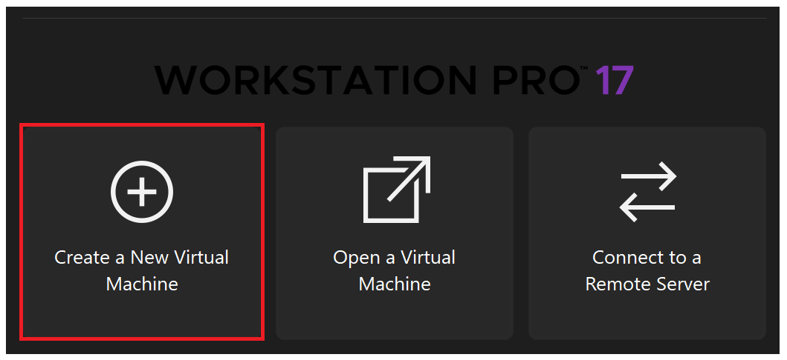
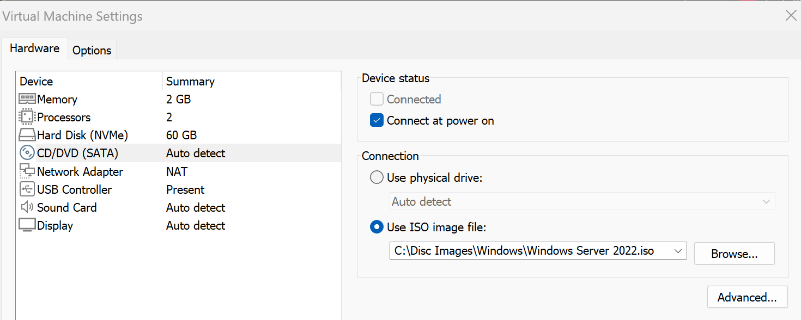
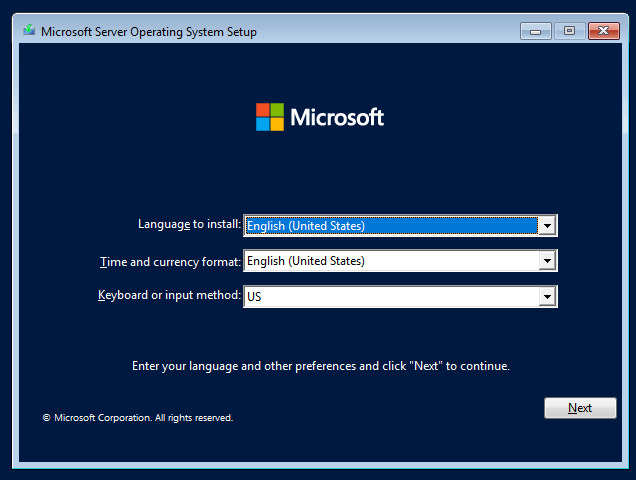
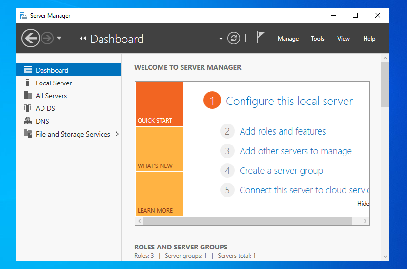

# Active Directory Setup


In this project we will setup **Active Directory** in a **Windows Server 2022** virtual machine for our domain.

A **domain** is a logical grouping of computers, users, and resources. 

**Active Directory** is a service that authenticates and authorizes all users, computers, and resources within a domain.


## Operating Systems
- Windows 11 (x86-64)
- Windows Server 2022 (x86-64)

## Environments and Technologies Used
- [VMware Workstation Pro for Personal Use (Windows)](https://knowledge.broadcom.com/external/article?articleNumber=368667)
- [Windows Server 2022 ISO](https://www.microsoft.com/en-us/evalcenter/download-windows-server-2022)

## Setup
### Downloads
First I downloaded the **Windows Server 2022** ISO image and the **VMware Workstation Pro for Windows** hypervisor using the links above.


### VM Creation & OS Installation
After I installed the VMware hypervisor I created a Server 2022 VM. Then, I mounted the Server 2022 ISO image in the VM settings. 




Once the ISO image is mounted, you boot-up the VM and install the OS. <br/>



### AD Installation and Configuration

Logging into Server 2022 automatically opens **Server Manager**. 




In the Server Manager we select: <br/><br/>
```Manage > Add Roles and Features``` <br/>

This menu allows us to configure our Server 2022 server as an **Active Directory** *domain controller*. The **domain controller** is the name of the centralized server that will manage Active Directory.

Here we assign the server the *Active Directory Domain Services* role.


In the following menu we can then add a new **forest** and specify a **root domain name**. 


A *forest* is a top-level container that holds one or more child domains. It represent the entire AD ecosystem for an organization. The *root domain name* is the top-level domain for an organization and is the foundation for child domains added later, for example:

```
Root Domain: corp.local
    - Child Domain: us.corp.local
    - Child Domain: uk.corp.local
```

We add **`.local`** to tell Windows Server that the domain is a local domain, not a public internet domain.

After creating the forest Active Directory will be installed and the server will be configured as the domain controller!