# Network Printer Setup
In the project we will configure a printer for network sharing.


## Setup
### Connect Printer to Network

First we must connect the printer to the network. In a corporate environment this usually done using an ethernet connection.

When using internet we connect it to the ethernet port on the printer and the wall. The ethernet port on the wall must be the port associated with the PRINTERS VLAN for the network.

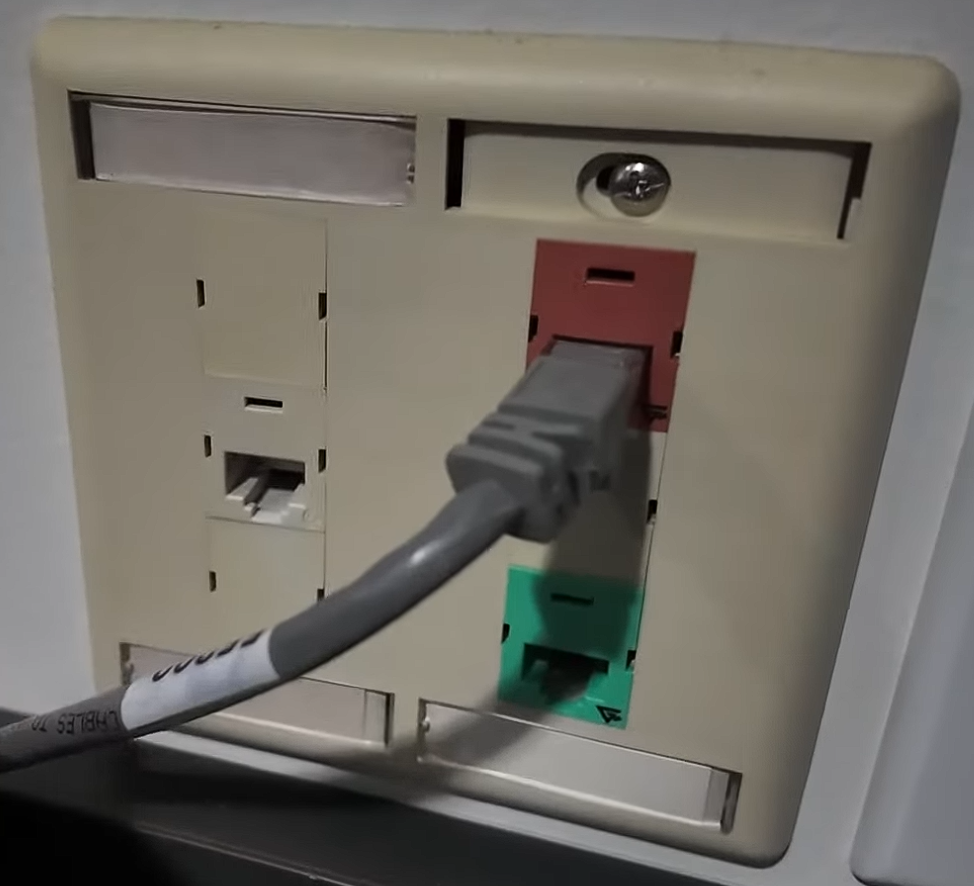

### Configure Static IP
Now we will assign a static IP to the printer. This ensures the IP address will remain the same in case the DHCP sever shuts down.

To configure the static go to your printers **Network Settings**, then **TCP/IP settings**, and finally the **IPv4 settings**.

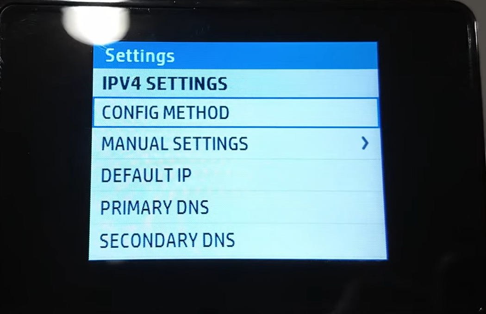

Here we will configure the IP address, subnet mask, default gateway, and DNS servers.

### Add Printer to Printer Server
Now we can add the printer to the Print Server. First we must ensure the **Print and Document Services** role is added to Server Manager.

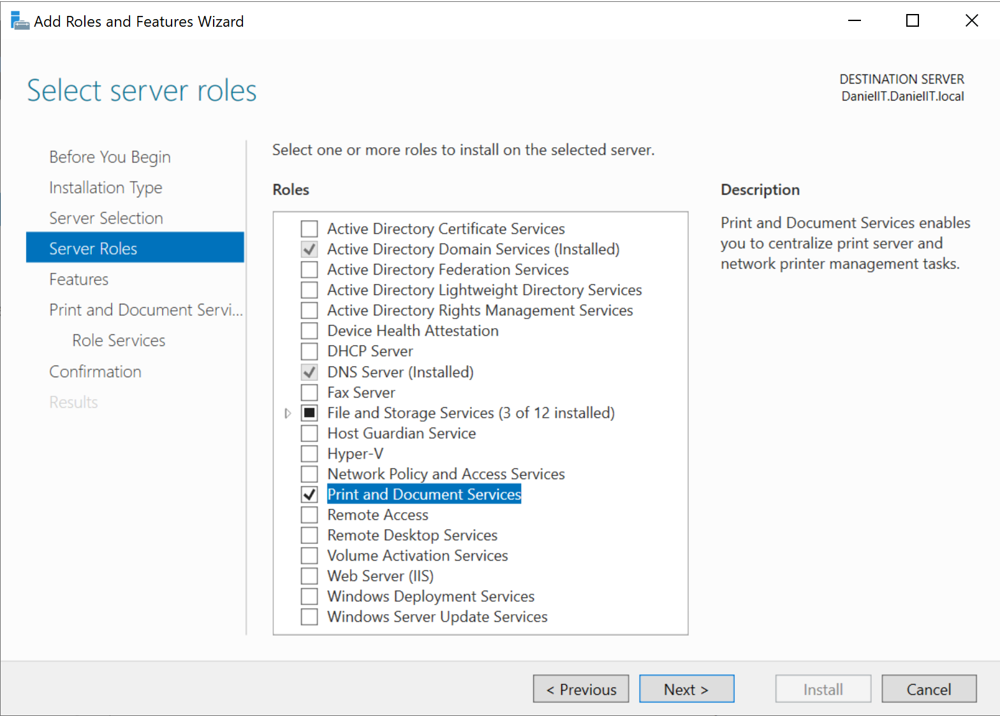

After it installed we can now access the **Print Management** console in **Windows Administrative tools**.

Once we are here we add the printer using the static IP we assigned to the printer.

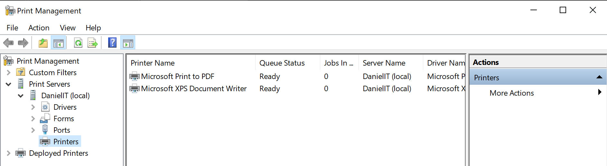

### Add Network Printer to Client PC
On windows we go to:

```Settings > Bluetooth & Devices > Printers & Scanners > Add Device > Add a new device manually > Select a shared printer by name```


Here we enter the network path of the printer we added to our print server.

## Troubleshooting
If we have trouble connecting to the printer from our client, these are some common troubleshootings steps.

### Power and Connection

If cannot connect to the printer, the first step we should take is make sure it is powered on.

If it is, then check if there is an ethernet connection from the printer to the correct VLAN port.

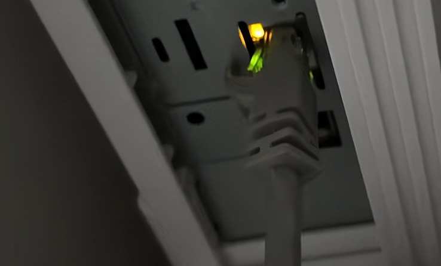

### Use Printer Offline and Pause Printing
Sometimes when the printer powers off, reboots, or the network connection drops, the printers **Use Printer Offline** or **Pause Printing** setting is enabled.
This **stops** the client from sending print jobs to the printer.

To resolve this issue we select our printer in **Bluetooth & Devices** and disable this setting.

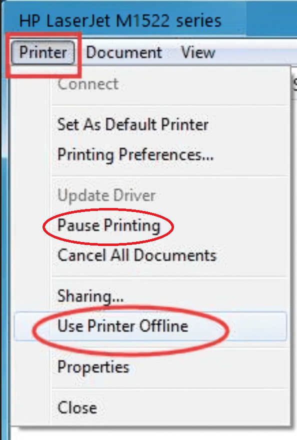

### Ensure Printer Network Connection
Next we must ensure the printer is reachable on the network.

First we check the printer IP address by printing a network configuration page from the printer settings.

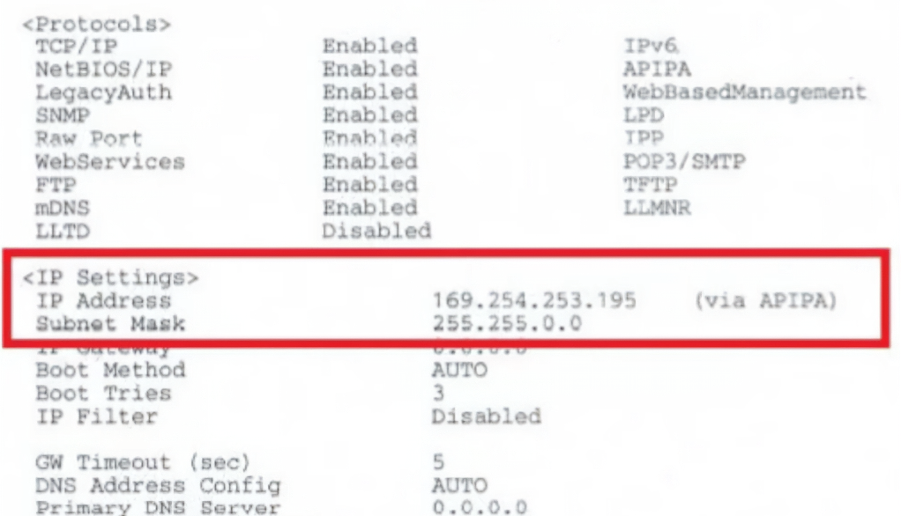

Then we using ```ping``` using the appropriate IP address.

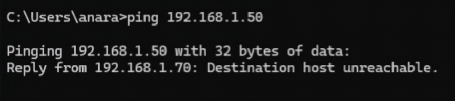

### Enable File and Printer Sharing
If the printer is not reachable it may be because file and printer sharing is not enabled on the server.

To turn this on we go to the following control panel path:

```Control Panel\Network and Internet\Network and Sharing Center\Advanced sharing settings```

Then we turn on File and Printer sharing.

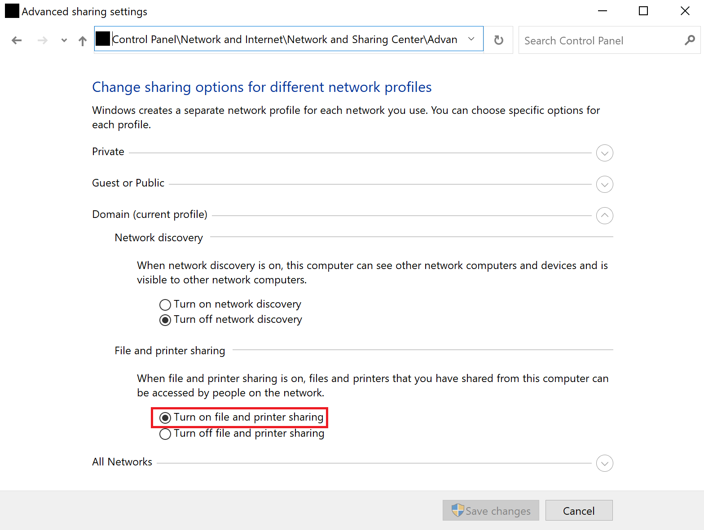

### Restart Print Spooler
The print spooler is the service that manages print requests. Restarting it may resolve the issue.

To restart it we go to the services console:

```Win+R > services.msc```

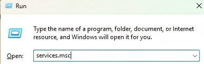

Then we navigate to Print Spooler:

```Right-click > Restart```

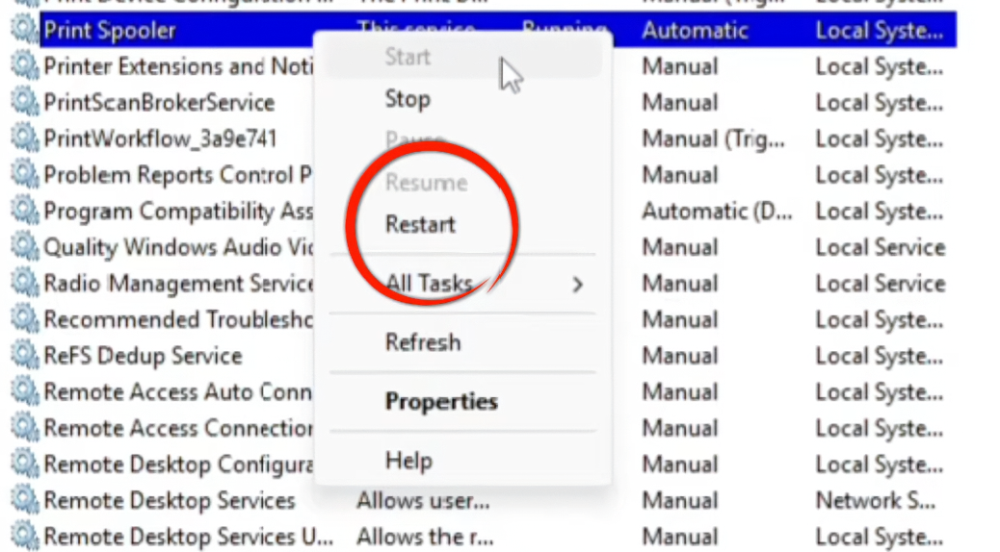