# Shared Mailbox, Distribution Group, and Message Trace
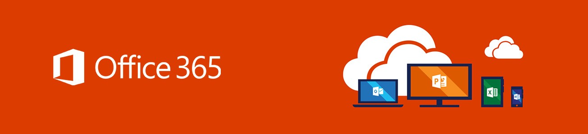

In this project we will go over shared mailboxes, distribution lists, and message trace in **Exchange Online**.

**Exchange Online** is Microsoft's cloud-based **email and calendaring service**. 

The **Exchange admin center** is the management console used to **configure**, **manage**, and **monitor email services** for Exchange Online.

We can access the Exchange admin center in the **Office 365 admin center**.

```...Show all > Admin centers >  Exchange```

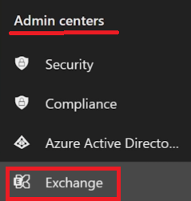

## Shared Mailbox
A shared mailbox is a mailbox shared by multiple users. The users are typically from a common department, i.e. ITSharedMailbox, FinanceSharedMailbox.

Creating a shared mailbox also creates an email for the mailbox that users can use to send emails.

### Creation
We can create a shared mailbox in the Exchange admin center.

```Recipients > Mailboxes```

This takes us to the **Manage mailboxes** page where we can create a shared mailbox.

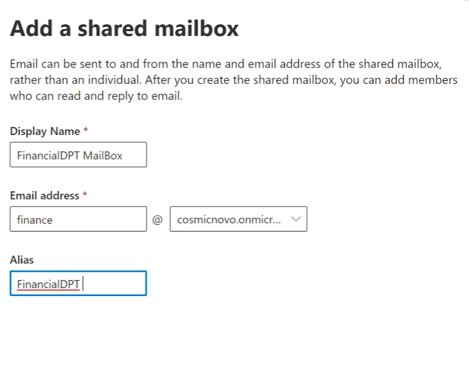

### Configuration
After it is created, we add users to the mailbox by immediately selecting ```Add users to this mailbox``` or going to the **Manage mailbox delegation** settings.

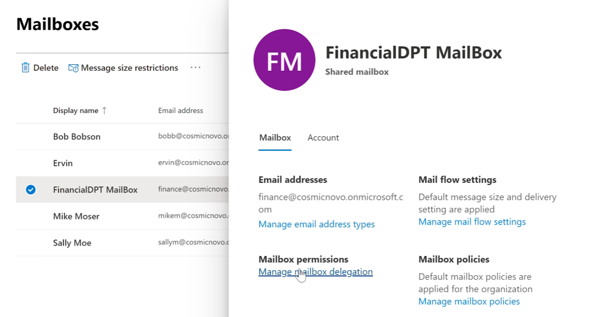

Here we can specify what users can **read and manage** the mailbox or **Send as**. Send as allows users to use the shared email for the mailbox to send emails.

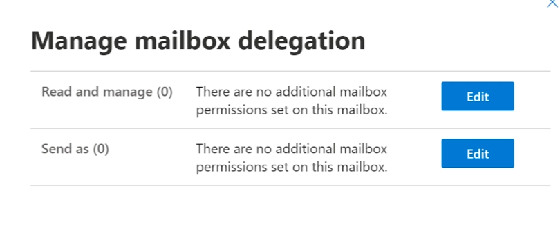

After adding the users, the user can add the shared mailbox to their personal mailbox by righ-clicking the left pane and selecting **Add shared folder**.

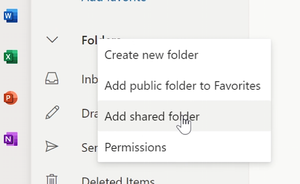

After this we eneter the email address of the shared mailbox in the pop-up prompt. The shared mailbox should now appear as a folder in the left pane.

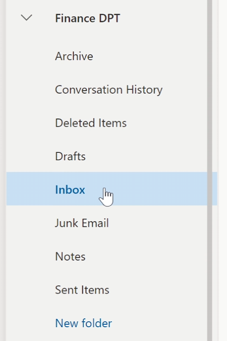

We can now view messages and reply to messages sent to this mailbox.

We can reply to messages either from our personal email or if we configured the **Send as** setting, then we can send it using the shared mailbox email.

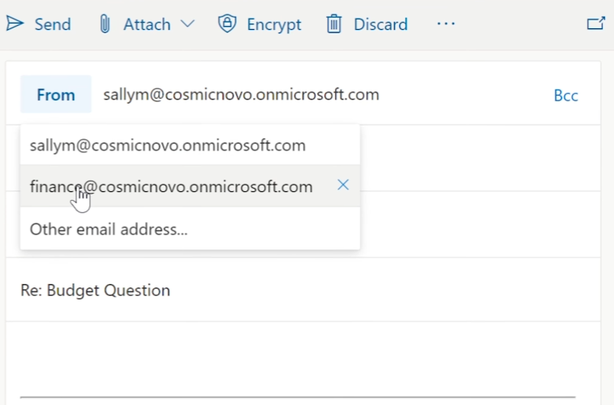

## Distribution Group
A distribution group creates a shared email for a group of people that can be used to send emails to multiple users, groups, or shared mailboxes.

## Creation
In the Exchange Online admin center we go to:

```Recipients > Groups```

Then in the Groups page would go to the **Distribution List** tab and select ```Add a group```.

In the follow menu we can create the Distribution group type.

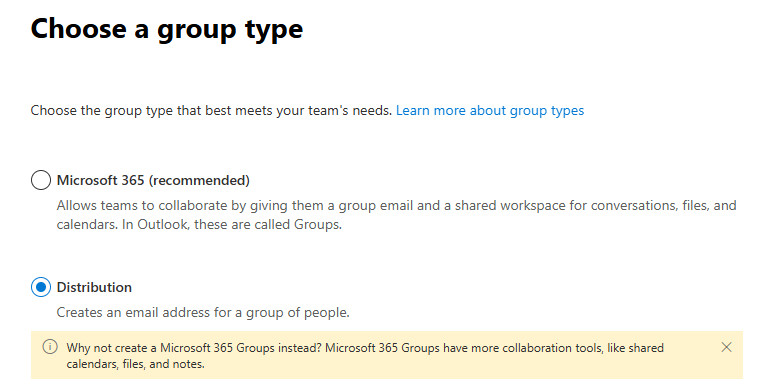

We can also create a **Microsoft 365 group** instead which offers more shared tools, but both are fine for creating a shared email.

After selecting the group type we specify other details as well:

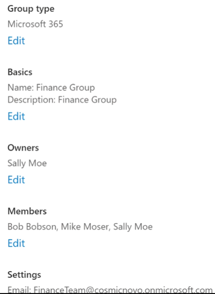

- Basics
    - Group Name
    - Description
- Owners
    - The owners of the group
- Members
    - The members of the groups
        - Can include users, shared mailbox emails, distribution group emails.
- Settings
    - Shared email address
    -  Add Microsoft Teams to group

Now, we will receive emails in our mailbox sent to the shared email for the distribution group.

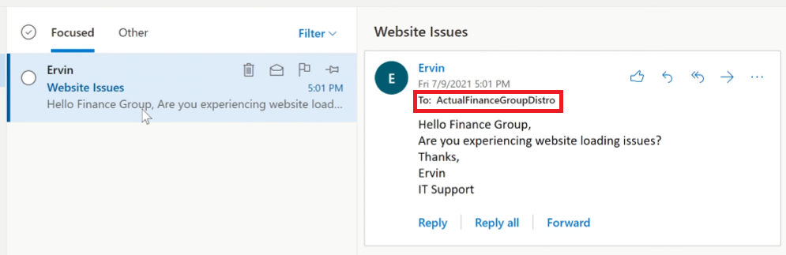

## Message Trace
Message trace is a report creation tool used to track and troubleshoot email delivery.

### Creation

To create a message trace, we navigate to:

```Mail flow > Message trace```

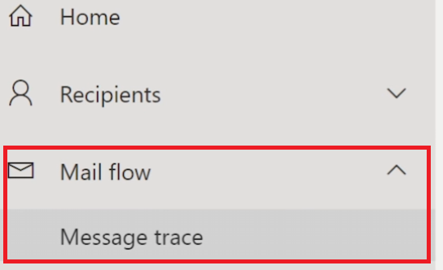

This will take us to the Message trace page. We can select **Start a trace** to search messaging data from the *last 90 days*.

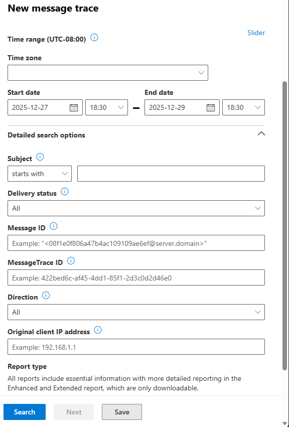

After filling out the search criteria, Message trace will provide reports of the messages meeting the criteria. We can then select the message we received an issue about.

### Message Trace Report
After selecting the appropriate message we can view the report. We can use this to determine an appropriate action.

A regular message can be either **Received, Processed, or Delivered**.

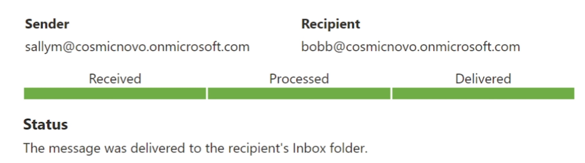

These can be thought of stages a package goes through in a shipping center:

- **Received** means Exchange Online accepted the message into Microsoft's system.
- **Processed** means the message ran through all checks.
    - Spam / phishing
    - Malware scanning
    - Transport rules
    - Policies
- **Delivered** means the messaged was placed successfully in the recipient's mailbox. This can include the:
    - Inbox
    - Junk Email folder
    - Another folder (via Outlook rule)

If a message is processed but not delivered, this means it was quarantined or blocked/failed.

### Report Message
If an incorrect action was taken by Exchange Online, then we can report the message. 

Reporting the message will take us to the Security & Compliance admin center.

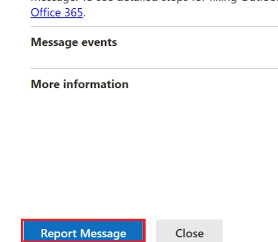

Here we can report a **False positive** or **False negative**.

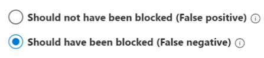

After creating the report the message will be reviewed.