# Jira Setup
## Summary
A **ticketing system** is used to manage issues and requests from users in your organization.

We will setup a ticketing system for this project and create an example incident.

## Setup

**Jira** is a popular to platform to manage tickets. You can create a free-trial to start creating your own tickets.

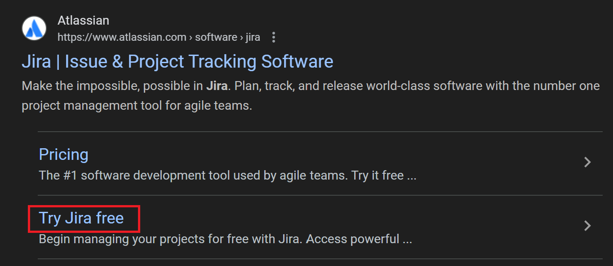

In Jira IT tickets are managed in an **IT service management** space. We can create a space using a template.

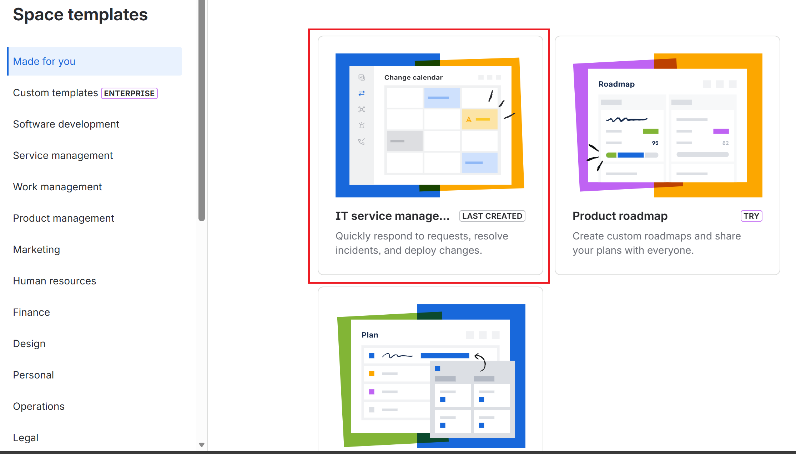

## Tickets

### Creation
Once the space is setup, we can create an **incident** so IT can resolve our issue.

The **Create** option is next to the search bar.

We will create an **incident**.

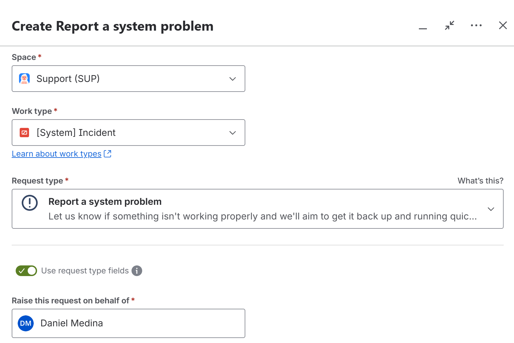

An incident is created when:
- A user **can't do their job**.
- Something **unexpected** is broken.
- A service is **not working** or **unresponsive**.

### Form Information

**Summarize this problem** should clearly communicate the issue.

**Describe what happened and how it occurred** should be as specific as possible. It should also contain any alternative contact information if you are not available through email.

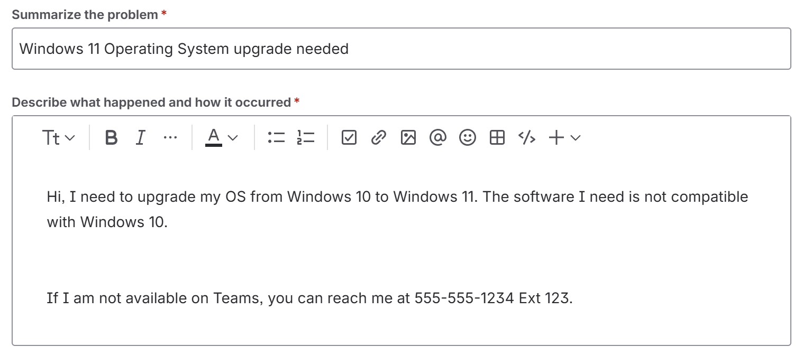

Then we should state state the proper **urgnecy** and **impact**.

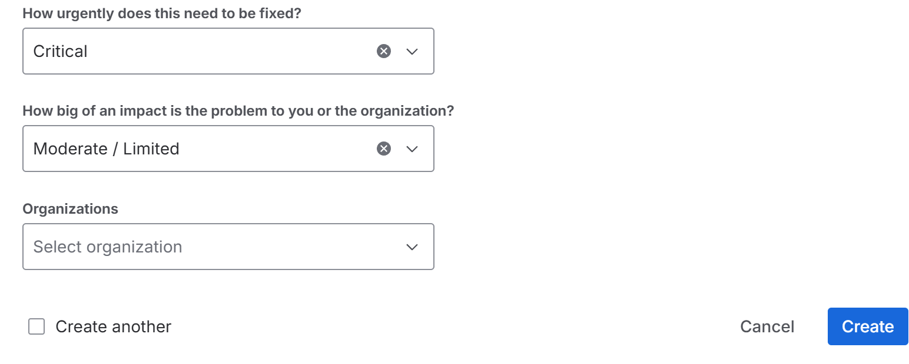

**How urgently does this need to be fixed?** should describe how fast action needs to be taken. **Critical** being immediately and **Low** being a minor inconvenience.

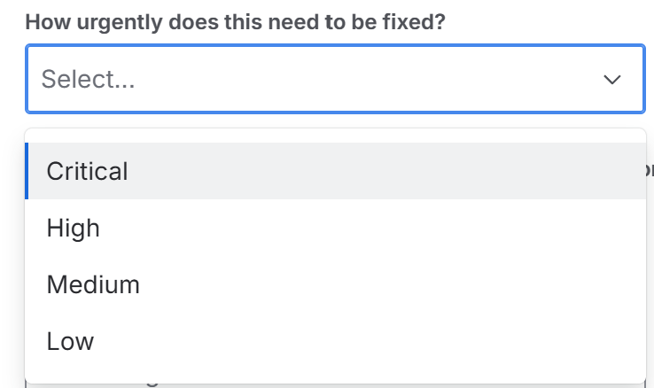

**How big of an impact is the problem to you or the organization?** describes the amount of people affected. **Extensive** being the entire organization and **Minor** just being a single person.

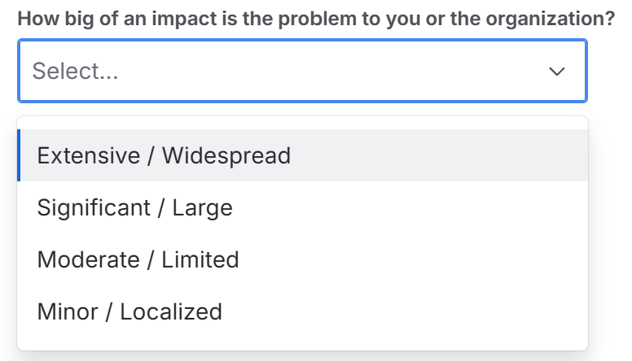

Depending on the urgency and impact, Jira will assign a priority to the ticket. The below matrix is what's typically used to assign priority.

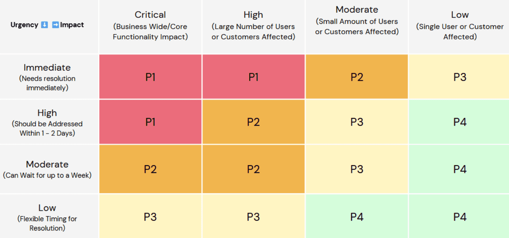

We can view open incidents in the Jira IT service management space.

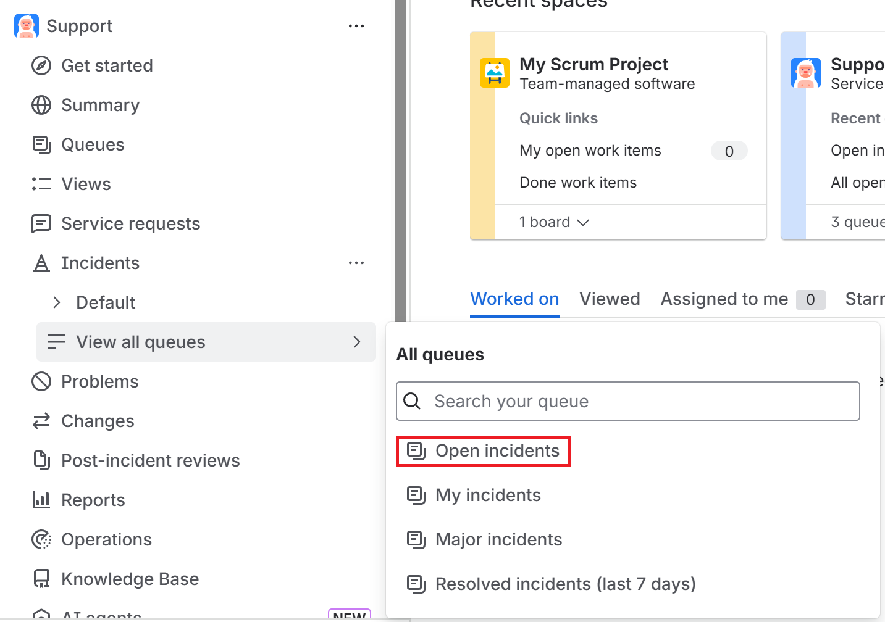

Here, we can assign ourselves tickets.

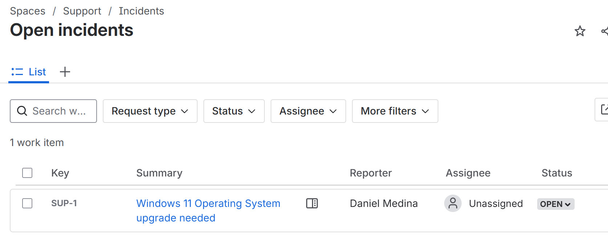

If we click on the ticket we can view the **SLA** or **Service Level Agreement**. 

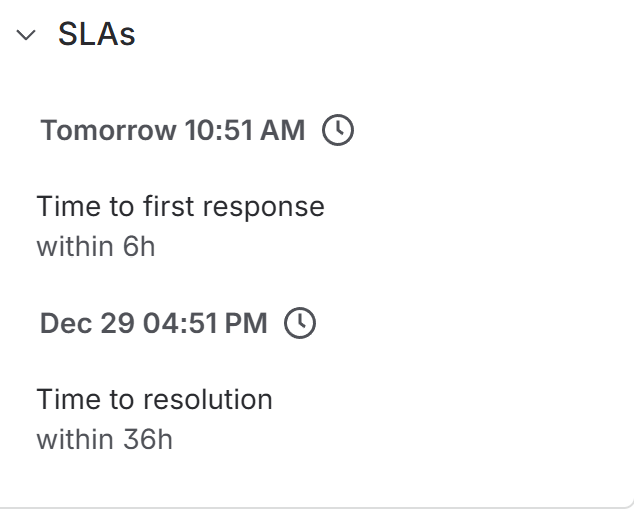

This tells us **how fast we should respond** to an open ticket and **how much time it should be resolved in**, depending on the priority to ensure **customer satisfaction**.